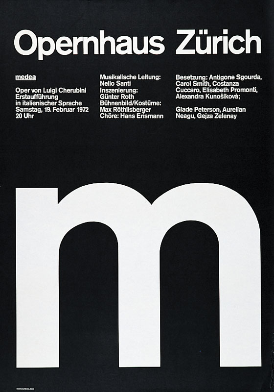
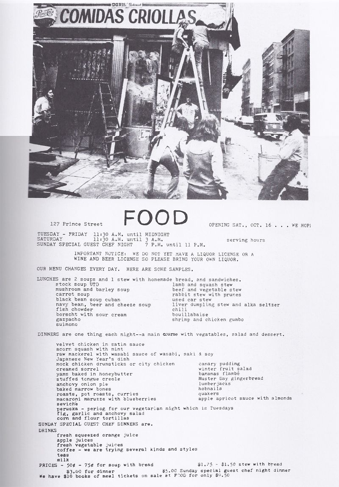
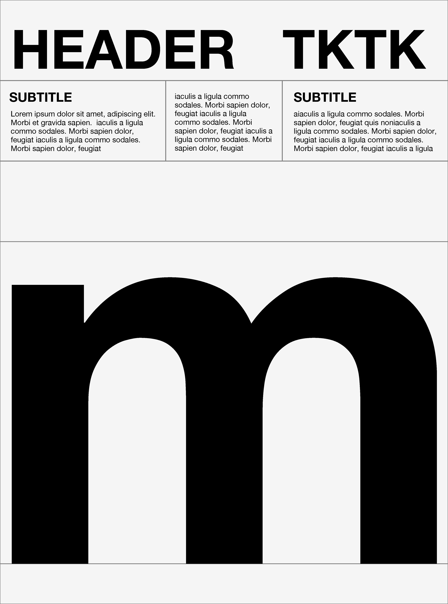
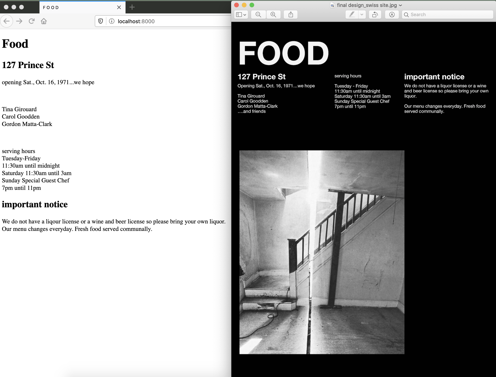

#website for FOOD

###about

For this assignment, I'm reimagining printed promotional files from[Food, an artist run restarurant started in 1971 by Carol Goodden, Tina Girouard and Gordon Matta-Clark](https://en.wikipedia.org/wiki/FOOD_(New_York_restaurant), as a website. 

-----------------------------------

###notes and process*

*challenges*

*references & inspiration*
I chose this image as my inspiration source for design: 

I also used this printed promo that FOOD released in 1971, to announce the restaurant's opening. I took this text and used it on my site.

-----------------------------------
###process

*prerequisites*

Just a modern browser to view. 

*develop*
Part I
1. After I chose my inspiration, I started sketching. This is my final sketch before moving to to digital rendering in Sketch. 

2. From there, I moved into designing in Sketch. I started with a wireframe to block out the design based on the poster. This is my first digital pass at the design. 

3. My next move was to set up my style guide. I knew I would need to adjust things as I design the final but given that I was working from rather concise reference material, I knew alot to begin with. I decided to go with Helvetica Neue typeface. For colors, I played a bit and came up with colors that read as black and white but were a little less off the rack than the standard #FFFFF #00000. I knew I would need to finesse text size once I had elements in my final design. 
 
4. I set up my final design from my wireframe. I used the colors and font styling from my style guide. I did need to adjust the sizes of my H1, H2 and body text. I increased the header text and subtitle text to create more drama and decreased the body text. It's a bit of a departure from the original source but it fits my copy better. 
 

Part II
5. I'm ready to move to HTML. This was pretty easy, using the guides I set up. The information heiarchy was clear and I got this up and running pretty easily. In the past I've struggled a bit with this part. 
 
6. CSS! UGH...this is a bit of a nightmare. It's also the fun stuff. But wow. That gird stuff is tricky. I tried a few different approaches. Honestly, I don't have a good baseline understanding of how the structural stuff works. There's SO MUCH information online about it but it kinda just confuses me more...

*deployment*

This project is hosted on Github. It is deployed on Glitch. 

*built with*

I used Sketch, VS Code, Github and Glitch for this site. The page uses simple HTMl, CSS and Javascript. 

-----------------------------------
*questions*

I got kinda stuck in the CSS flex box. I was able to make my grid and get HTML content in place. I wanted to size my div boxes but found that even when I applied CSS to them, there was some inexplicable space - that did not seem to be padding, margin etc...halp! Also, my image did not fill the div container as expected. I reworked the grid and it seems a bit better but still cannot quite work out why my columns are not the same width- they are set to each be 32% but are showing s/m/l widths. 